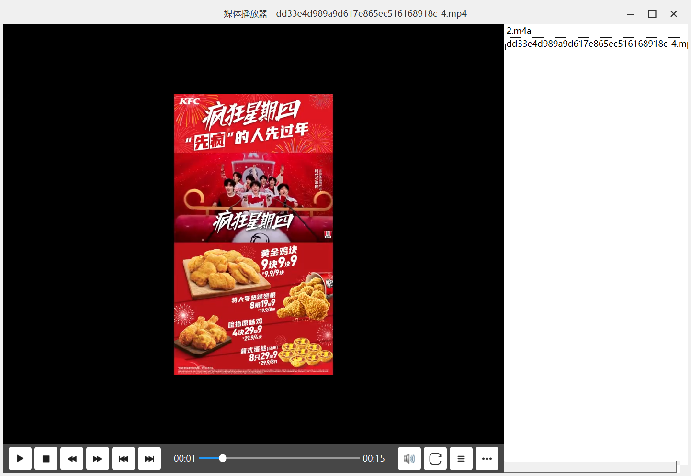
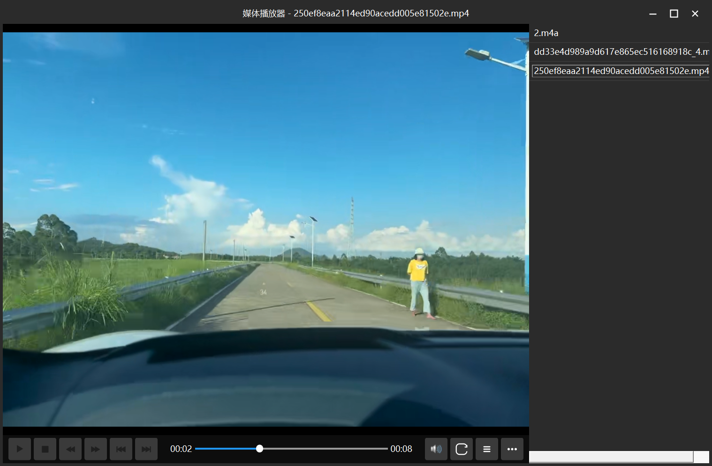
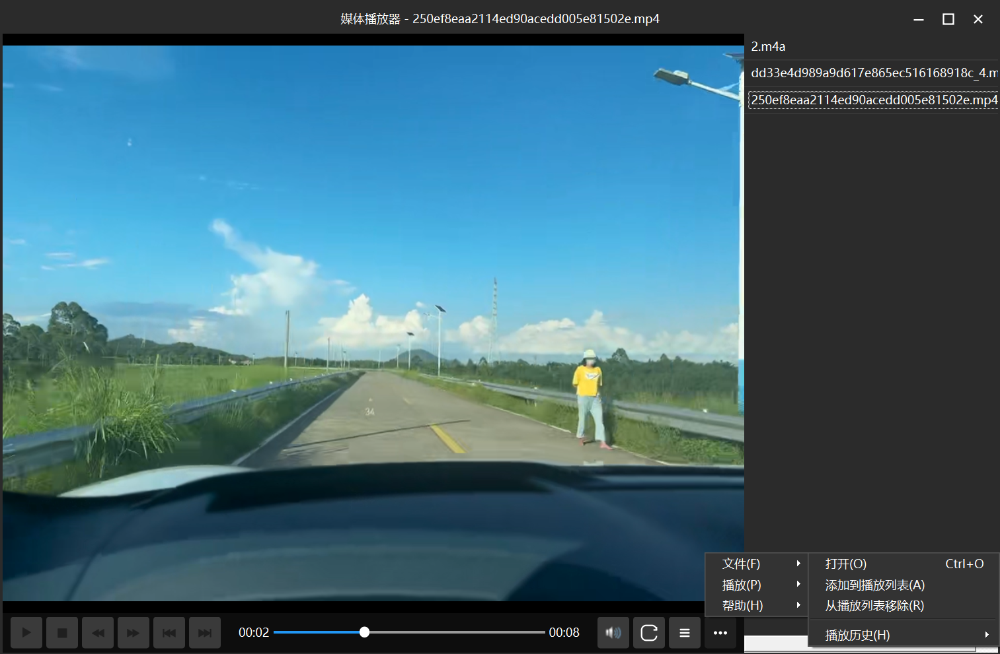
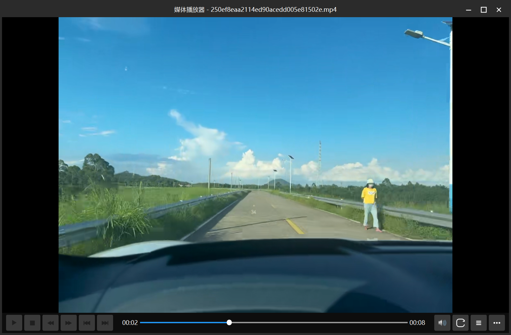

# 多媒体播放器
基于QT6.5.3 ，建议保持版本一直，有几个qt6的版本测试都有bug

# 项目架构

## 1. 总体设计

多媒体播放器是一款基于Qt 6.5.3开发的多媒体播放器，采用模块化设计思想，将播放器功能分解为多个独立且相互协作的组件。整个播放器架构清晰，便于维护和扩展。

主要特点：
- 无边框窗口设计，自定义标题栏
- 模块化组件结构，各模块职责单一
- 支持多种媒体格式播放，包括本地文件和流媒体
- 全功能的媒体控制，包括进度、音量、播放模式等
- 播放列表管理功能
- 全屏切换体验
- 缩略图预览功能
- 自定义样式和主题

## 2. 核心组件结构

播放器由以下核心组件构成：

### 2.1 主窗口（Player）
主窗口是整个应用的容器，负责协调各个组件的工作。Player类继承自QMainWindow，是播放器的主体框架，管理着所有子组件的集成。

### 2.2 边框容器（MyBorderContainer）
负责实现无边框窗口效果，处理窗口拖动、缩放等交互功能，让用户可以自由调整播放器窗口大小和位置。

### 2.3 标题栏（TitleBar）
自定义标题栏组件，包含窗口标题、最小化、最大化/还原、关闭按钮等控件，替代了系统原生标题栏。

### 2.4 媒体控制模块（MediaControl）
核心的媒体播放控制中心，负责：
- 播放/暂停/停止控制
- 进度调整与显示
- 音量控制
- 全屏切换
- 播放速率调整
- 缩略图预览生成

### 2.5 播放列表管理器（PlaylistManager）
管理媒体文件播放列表，支持：
- 添加/删除媒体文件
- 播放列表保存与加载
- 播放列表UI的显示与隐藏

### 2.6 菜单控制模块（MenuControl）
处理各类菜单操作，包括：
- 文件操作（打开、保存等）
- 播放模式切换（单曲循环、列表循环等）
- 视图控制

### 2.7 音量控制器（VolumeControl）
专门处理音量相关操作的弹出式控制面板。

## 3. 窗口布局设计

播放器窗口采用垂直分层布局，主要包含以下几层：

1. **自定义标题栏**：位于顶部，包含标题和窗口控制按钮
2. **视频播放区域**：中央主要区域，显示视频内容
3. **控制面板区域**：底部区域，包含播放控制按钮、进度条等
4. **播放列表面板**：可切换显示/隐藏，一般位于右侧

控制面板采用上下布局设计，位于视频区域下方，通过设置背景色为半透明黑色（rgba(0, 0, 0, 180)）提供良好的视觉体验。

## 4. 核心功能实现

### 4.1 媒体播放实现

播放功能基于Qt的QMediaPlayer实现，主要流程：

1. **媒体源加载**：
   - 通过QMediaPlayer的`setSource()`方法加载媒体文件或URL
   - 支持本地文件和HTTP/HTTPS流媒体URL

2. **视频输出处理**：
   - 使用QVideoWidget创建视频显示窗口
   - 通过QMediaPlayer的`setVideoOutput()`关联视频输出组件

3. **音频输出处理**：
   - QAudioOutput负责声音处理
   - 使用`setAudioOutput()`关联到媒体播放器
   - 通过`setVolume()`控制音量大小（0.0-1.0范围）
   - 使用`setMuted()`实现静音功能切换

4. **播放状态管理**：
   - 使用QMediaPlayer的`play()`, `pause()`, `stop()`控制播放状态
   - 通过`playbackStateChanged()`信号响应状态变化
   - MediaControl类的`togglePlayPause()`方法实现播放/暂停切换

```cpp
// 播放与暂停切换的核心实现（MediaControl类）
void MediaControl::togglePlayPause()
{
    if (!m_mediaPlayer->source().isEmpty() || m_playlistManager->getCurrentItem()) {
        switch (m_mediaPlayer->playbackState()) {
            case QMediaPlayer::PlayingState:
                pause();
                break;
            case QMediaPlayer::PausedState:
                play();
                break;
            case QMediaPlayer::StoppedState:
                if (m_mediaPlayer->source().isEmpty() && m_playlistManager->getCurrentItem()) {
                    QListWidgetItem* item = m_playlistManager->getCurrentItem();
                    if (item) {
                        playFile(item->data(Qt::UserRole).toString());
                    }
                } else {
                    m_mediaPlayer->setPosition(0);
                    play();
                }
                break;
        }
    } else {
        // 打开新文件的逻辑
        QMetaObject::invokeMethod(m_player, "openFile");
    }
}
```

5. **播放进度控制**：
   - 使用`setPosition()`方法改变播放位置
   - `positionChanged()`和`durationChanged()`信号更新进度条
   - 通过Player类中的`formatTime()`方法格式化时间显示

6. **播放结束处理**：
   - 监听QMediaPlayer的`mediaStatusChanged()`信号
   - 根据MenuControl中设置的播放模式执行不同的结束处理逻辑

### 4.2 自定义无边框窗口

无边框窗口通过以下关键技术实现：

1. **窗口属性设置**：
   - 使用`setWindowFlags(Qt::FramelessWindowHint)`移除默认边框
   - 设置`Qt::Popup | Qt::FramelessWindowHint`标志创建无边框弹出窗口

2. **自定义边框容器**：
   - 通过MyBorderContainer类实现窗口边框和缩放功能
   - 基于QGridLayout的九宫格布局，中心放置内容，周围放置边框代理

```cpp
// MyBorderContainer的初始化代码
void MyBorderContainer::initBorder()
{
    // 创建边框容器
    m_borderContainer = new QWidget();
    m_borderContainer->setObjectName("borderContainer");
    m_borderContainer->setMouseTracking(true);
    
    // 创建网格布局
    m_gridLayout = new QGridLayout(m_borderContainer);
    m_gridLayout->setSpacing(0);
    m_gridLayout->setContentsMargins(0, 0, 0, 0);
    
    // 创建边框代理
    labelLft = new MyBorder(m_borderContainer, L_BORDER, this);
    labelRit = new MyBorder(m_borderContainer, R_BORDER, this);
    labelBot = new MyBorder(m_borderContainer, B_BORDER, this);
    labelTop = new MyBorder(m_borderContainer, T_BORDER, this);
    labelRB  = new MyBorder(m_borderContainer, RB_BORDER, this);
    labelRT  = new MyBorder(m_borderContainer, RT_BORDER, this);
    labelLB  = new MyBorder(m_borderContainer, LB_BORDER, this);
    labelLT  = new MyBorder(m_borderContainer, LT_BORDER, this);
    
    // 将边框代理添加到网格布局中
    m_gridLayout->addWidget(labelLT, 0, 0);
    m_gridLayout->addWidget(labelTop, 0, 1);
    m_gridLayout->addWidget(labelRT, 0, 2);
    m_gridLayout->addWidget(labelLft, 1, 0);
    m_gridLayout->addWidget(labelRit, 1, 2);
    m_gridLayout->addWidget(labelLB, 2, 0);
    m_gridLayout->addWidget(labelBot, 2, 1);
    m_gridLayout->addWidget(labelRB, 2, 2);
    
    // 更新边框的几何形状
    updateBorderGeometry();
}
```

3. **缩放功能实现**：
   - 创建8个边框代理（MyBorder类），分别处理不同方向的缩放
   - 边框代理继承自QLabel并重写鼠标事件处理
   - 通过鼠标事件计算缩放位置和大小

4. **拖拽移动实现**：
   - TitleBar类重写mousePressEvent和mouseMoveEvent
   - 记录拖拽起始位置，计算窗口移动偏移
   - 处理窗口最大化状态下的特殊拖拽情况，实现自动还原

5. **窗口控制按钮**：
   - 使用Qt标准图标设置最小化、最大化/还原、关闭按钮
   - 连接按钮点击信号到窗口控制槽函数

### 4.3 进度预览功能

进度条预览功能通过以下方法实现：

1. **预览播放器初始化**：
   - 在MediaControl类中创建独立的QMediaPlayer实例用于预览
   - 使用`setupPreviewPlayer()`方法初始化预览组件

2. **缩略图生成**：
   - 创建QLabel作为预览容器
   - 设置工具提示窗口标志`Qt::ToolTip | Qt::FramelessWindowHint`

3. **预览交互处理**：
   - 在MediaControl的`showThumbnailPreview()`方法中设置预览位置
   - 根据鼠标在进度条上的位置计算媒体文件相应时间点
   - 预览播放器定位到该时间点并显示帧内容

4. **时间标签显示**：
   - 使用QLabel在预览窗口中显示当前时间点
   - 通过`formatTime()`方法将毫秒转换为可读时间格式

5. **预览状态管理**：
   - 使用PreviewState枚举管理预览状态（Hidden、Showing、Visible、Hiding）

### 4.4 播放列表管理

播放列表管理通过PlaylistManager类实现：

1. **播放列表UI构建**：
   - 使用QListWidget组件显示媒体文件列表
   - setupPlaylist()方法初始化列表控件和样式

2. **列表项操作**：
   - `addToPlaylist()`方法通过QFileDialog获取文件
   - 使用QListWidgetItem存储文件路径和显示名称
   - 数据存储在Qt::UserRole角色中，便于后续访问

```cpp
// PlaylistManager中的addToPlaylist方法实现
void PlaylistManager::addToPlaylist()
{
    QStringList files = QFileDialog::getOpenFileNames(
        qobject_cast<QWidget*>(parent()),
        "添加媒体文件",
        QStandardPaths::standardLocations(QStandardPaths::MoviesLocation).value(0),
        "媒体文件 (*.mp3 *.mp4 *.avi *.mkv *.flac *.wav *.ogg);;所有文件 (*.*)"
    );

    if (files.isEmpty())
        return;

    for (const QString &filePath : files) {
        QFileInfo fileInfo(filePath);
        QListWidgetItem *item = new QListWidgetItem(fileInfo.fileName(), playlistWidget);
        item->setData(Qt::UserRole, filePath);
        item->setToolTip(filePath);
    }

    // 保存播放列表
    saveDefaultPlaylist();
    
    // 如果是第一个添加的项目，且播放器正在停止状态，则自动开始播放
    if (playlistWidget->count() == files.count()) {
        emit playRequested(files.first());
    }
}
```

3. **列表交互**：
   - 通过双击触发播放，发送`playlistItemDoubleClicked`信号
   - 右键菜单通过`showPlaylistContextMenu()`方法实现

4. **播放模式实现**：
   - MenuControl类中定义PlayMode枚举（顺序、循环、单曲循环、随机）
   - 监听QMediaPlayer的`mediaStatusChanged`信号处理播放结束逻辑
   - 根据不同的播放模式执行不同的下一曲选择算法

5. **列表持久化**：
   - `saveDefaultPlaylist()`和`loadDefaultPlaylist()`方法
   - 使用QFile和QTextStream写入和读取播放列表文件
   - 播放记录存储在应用程序目录下

### 4.5 音量控制

音量控制通过volumeControl类实现：

1. **弹出式控制面板**：
   - 继承自QWidget，设置Qt::Popup和Qt::FramelessWindowHint窗口标志
   - `showVolumeControl()`方法根据按钮位置显示面板

2. **音量调节**：
   - 使用QSlider组件实现音量拖动调节
   - 通过`volumeChanged`信号通知音量变更
   - `setVolume()`方法设置滑块值并更新显示

3. **静音功能**：
   - `onVolumeIconClicked()`方法切换静音状态
   - 根据静音状态切换图标显示
   - 发送`muteToggled`信号通知静音状态变更

```cpp
// volumeControl的静音切换实现
void volumeControl::onVolumeIconClicked()
{
    m_isMuted = !m_isMuted;
    setMuted(m_isMuted);
    emit muteToggled(m_isMuted);
}

void volumeControl::setMuted(bool muted)
{
    m_isMuted = muted;
    if (muted) {
        ui->volumeIcon->setIcon(QApplication::style()->standardIcon(QStyle::SP_MediaVolumeMuted));
    } else {
        ui->volumeIcon->setIcon(QApplication::style()->standardIcon(QStyle::SP_MediaVolume));
    }
}
```

4. **自动隐藏逻辑**：
   - 使用QTimer实现2秒自动隐藏功能
   - 在鼠标移动和点击事件中重置定时器
   - leaveEvent处理鼠标离开事件

5. **音量点击调节**：
   - 通过安装事件过滤器处理鼠标点击事件
   - 在eventFilter中计算点击位置对应的音量值

### 4.6 全屏切换

全屏切换功能通过以下方法实现：

1. **切换功能实现**：
   - MediaControl类的`toggleFullScreen()`方法控制全屏状态
   - 使用QMainWindow的`showFullScreen()`和`showNormal()`方法

2. **全屏事件响应**：
   - 监听windowStateChanged信号
   - 在Player类的`onWindowStateChanged()`方法中处理状态变化

3. **双击激活全屏**：
   - 为视频区域和标题栏安装事件过滤器
   - 在事件过滤器中处理鼠标双击事件
   - TitleBar类发出doubleClicked信号触发`toggleFullScreen()`

4. **快捷键支持**：
   - 通过QShortcut绑定F11键实现全屏切换
   - Esc键用于退出全屏模式

## 5. 数据持久化

播放器采用QSettings框架实现配置数据持久化：

1. **配置项存储**：
   - 使用`QSettings::setDefaultFormat(QSettings::IniFormat)`设置INI格式
   - 设置文件保存在应用程序目录下

```cpp
// main.cpp中的配置初始化
int main(int argc, char *argv[])
{
    QApplication a(argc, argv);
    
    // 设置组织名和应用名
    QCoreApplication::setOrganizationName("SparkPlayer");
    QCoreApplication::setApplicationName("SparkPlayer");
    
    // 配置QSettings使用INI文件并存放在可执行文件目录下
    QString settingsPath = QCoreApplication::applicationDirPath() + QDir::separator() + "settings.ini";
    QSettings::setDefaultFormat(QSettings::IniFormat);
    QSettings::setPath(QSettings::IniFormat, QSettings::UserScope, QCoreApplication::applicationDirPath());
    
    // 设置全局变量用于显示配置文件路径
    qputenv("MULTI_PLAYER_SETTINGS", settingsPath.toUtf8());
    
    Player w;
    w.show();
    return a.exec();
}
```

2. **主要配置内容**：
   - 窗口几何信息（大小、位置、状态）
   - 音量和静音设置
   - 上次播放文件和位置
   - 播放模式设置
   - 用户界面主题选择

3. **保存实现**：
   - 应用退出时在Player类的`closeEvent()`中调用`saveSettings()`
   - 使用QSettings的setValue()方法保存各类配置值

4. **加载实现**：
   - 在Player构造函数中调用`loadSettings()`
   - 使用QSettings的value()方法读取配置值并应用

5. **播放历史记录**：
   - 使用PlayHistory结构体存储历史记录信息
   - MenuControl中实现历史记录的保存和加载功能

## 6. 技术要点

1. **信号-槽机制应用**：
   - 使用Qt的信号-槽机制实现组件间通信
   - 避免组件间强耦合，提高代码可维护性
   - 例如：mediaPlayer的playbackStateChanged信号连接到updatePlayIcon槽

2. **事件过滤器应用**：
   - 使用eventFilter机制拦截和处理特定组件的事件
   - 实现双击全屏、点击音量调节等功能

3. **样式表应用**：
   - 使用Qt样式表(QSS)定义界面外观
   - 支持浅色和深色两种主题切换

4. **自定义窗口框架**：
   - 通过QGridLayout实现自定义窗口边框
   - 实现拖拽缩放等原生窗口功能

5. **组件化设计**：
   - 功能模块化，如媒体控制、播放列表管理等
   - 组件之间通过明确定义的接口通信

## 7. 未来扩展

1. 支持更多媒体格式和解码器
2. 添加均衡器和音效处理
3. 实现网络媒体库功能
4. 开发插件系统允许功能扩展
5. 支持多语言本地化

## 8.部分项目效果截图








